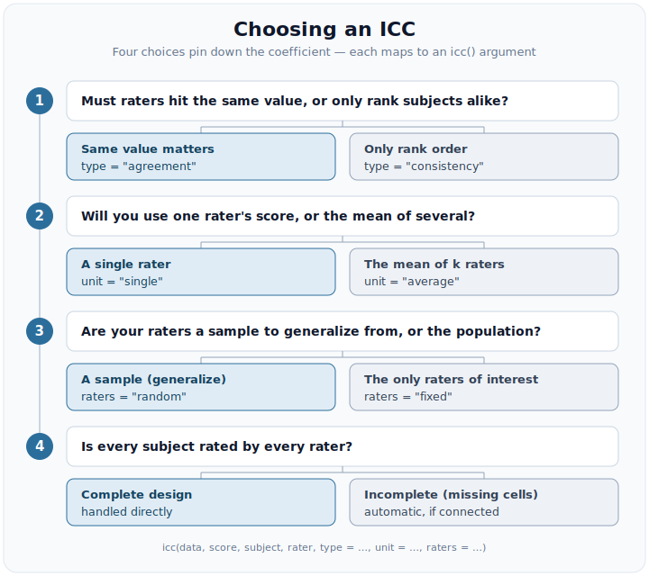

```{r, include = FALSE}
knitr::opts_chunk$set(collapse = TRUE, comment = "#>")
library(intraclass)
```

"Which ICC should I report?" is the question this package is built to answer.
There is no single intraclass correlation: the label hides a family of
coefficients that estimate *different* population quantities. Report the wrong
one and you can overstate reliability by a wide margin, or penalise a rating
procedure for differences that do not matter to you.

Four choices pin down the coefficient. Each is a single argument to `icc()`, and
each is a genuine decision about your measurement -- not a technicality.

```{r tree, echo = FALSE, out.width = "100%", fig.alt = "A four-step decision flow: agreement vs. consistency (type), single vs. average (unit), random vs. fixed raters (raters), and complete vs. incomplete designs, each mapping to an icc() argument."}

```

We work through the four choices on one dataset so the numbers are comparable.

## The data

`ratings` is the six-subject, four-rater example of Shrout and Fleiss (1979),
in the long, one-row-per-rating format `icc()` expects. Every subject is rated
by every rater, so it is a complete, balanced two-way design -- the clean case
in which the choices below are easiest to see.

```{r data}
str(ratings)
```

## 1. Agreement vs. consistency (`type`)

**Does the actual value need to match, or only the rank order?** *Absolute
agreement* treats a systematic difference between raters -- one judge scoring
consistently higher than another -- as error. *Consistency* forgives a constant
per-rater offset and asks only whether raters rank subjects the same way.

```{r type}
agreement <- icc(ratings, score, subject, rater, type = "agreement", seed = 2024)
agreement

consistency <- icc(ratings, score, subject, rater, type = "consistency", seed = 2024)
consistency
```

```{r type-values, echo = FALSE}
a1 <- tidy(agreement)$estimate[1]
c1 <- tidy(consistency)$estimate[1]
```

Here `ICC(A,1)` is `r sprintf("%.2f", a1)` but `ICC(C,1)` is
`r sprintf("%.2f", c1)`. The gap is not noise -- it is a direct read-out of how
much the raters differ in average level. Consistency is never smaller than
agreement, because it drops a source of error. Choose **agreement** when the
number itself must be trusted (a clinical score, a physical measurement) and
**consistency** when only relative standing matters (ranking applicants).

## 2. Single vs. average (`unit`)

**Will you use one rater's score, or the mean of several?** `icc()` returns both
rows by default: `ICC(*,1)` is the reliability of a *single* rater, and
`ICC(*,k)` is the reliability of the *mean* of your `k` raters. Averaging cancels
independent error, so `ICC(*,k)` is always the larger number (the
Spearman--Brown relationship).

```{r unit-values, echo = FALSE}
ak <- tidy(agreement)$estimate[2]
```

For absolute agreement above, the single-rater `r sprintf("%.2f", a1)` rises to
`r sprintf("%.2f", ak)` for the four-rater mean. Report `ICC(*,k)` only if the
averaged score is what you will actually act on; if downstream users see one
rater's judgement, `ICC(*,1)` is the honest figure. Request one or both with
`unit = "single"`, `unit = "average"`, or the default `c("single", "average")`.

## 3. Random vs. fixed raters (`raters`)

**Are your raters a sample you want to generalize beyond, or the entire
population of interest?** *Random* raters (the default) are a sample; the
coefficient generalizes to the rater universe they were drawn from. *Fixed*
raters are the only judges you care about, and the coefficient does not
generalize past them.

```{r raters}
fixed <- icc(ratings, score, subject, rater, raters = "fixed", seed = 2024)
```

`icc()` warns on `raters = "fixed"` because random is the recommended default for
interrater reliability: fixing the raters answers a narrower question. On this
**balanced** design the fixed and random *point estimates* coincide, but they are
fit by different models and their intervals differ -- and on **incomplete** data
even the point estimates diverge (see below). Prefer **random** unless you truly
never intend to generalize beyond these exact raters.

## 4. Complete vs. incomplete designs

**Is every subject rated by every rater?** When cells are missing, the classical
ANOVA identities break down, but the mixed model `icc()` fits does not -- it uses
whatever ratings are present. Two things change automatically:

- The design must stay **connected** (the raters and subjects must form a single
  linked web); a disconnected design cannot separate subject from rater variance,
  and `icc()` fails loudly rather than returning a plausible-looking number.
- The averaging divisor for `ICC(*,k)` becomes the *effective* number of
  ratings, `k_eff`, the harmonic mean of the per-subject counts -- so it honestly
  reflects the ragged averages you actually computed.

### A worked incomplete design

`ratings_incomplete` is `ratings` with one change: rater 2 acted as a pilot and
scored only the first two subjects, leaving four empty cells.

```{r incomplete}
inc <- icc(ratings_incomplete, score, subject, rater, seed = 2024)
inc
```

The header now reads `20 of 24 cells (incomplete)`, and `ICC(*,k)` averages over
an *effective* 3.27 raters rather than 4 -- the harmonic mean of the per-subject
counts (four subjects were seen by three raters, two by all four). The estimate
sits a little below the complete-data value, as fewer ratings warrant.

### Fixed and random now diverge

On the balanced `ratings`, `raters = "fixed"` and `raters = "random"` returned
the same point estimate. On incomplete data they no longer do: they are
different models, and the missing cells give them different information about the
rater effects.

```{r incomplete-fixed}
random_inc <- tidy(icc(ratings_incomplete, score, subject, rater,
  raters = "random", seed = 2024))
fixed_inc <- suppressWarnings(tidy(icc(ratings_incomplete, score, subject, rater,
  raters = "fixed", seed = 2024)))

random_inc[, c("index", "estimate", "conf.low", "conf.high")]
fixed_inc[, c("index", "estimate", "conf.low", "conf.high")]
```

The random interval is the wider of the two: generalizing to a rater universe
carries the extra uncertainty of *which* raters you happened to sample, whereas
fixing the raters removes it. This is why the choice matters more once data are
incomplete.

### When a design is not identified

Connectedness is not a formality. If the raters split into groups that never
share subjects, a subject difference cannot be told apart from a rater
difference, and `icc()` stops rather than returning a plausible-looking number:

```{r disconnected, error = TRUE}
disconnected <- data.frame(
  subject = factor(c(1, 1, 2, 2, 3, 3, 4, 4)),
  rater = factor(c(1, 2, 1, 2, 3, 4, 3, 4)),
  score = c(5, 6, 4, 5, 7, 8, 6, 7)
)
icc(disconnected, score, subject, rater)
```

Subjects 1--2 are rated only by raters 1--2, and subjects 3--4 only by raters
3--4: two islands with no bridge between them. This is precisely the ill-posed
case the package refuses to guess at.

## A fifth choice: subject- vs. cluster-level

Everything above takes the subject as the object of measurement. When subjects
are themselves nested in higher-level units -- pupils within classrooms, patients
within clinics -- you may instead want the reliability of the *cluster* mean, a
multilevel ICC (ten Hove, Jorgensen & van der Ark, 2022). Pass a `cluster` column
to `icc()` and it reports the **subject-level** (within-cluster) and
**cluster-level** (between-cluster) coefficients side by side. The
[*Advanced*](advanced.html) article works a full example.

## Naming crosswalk

Two older naming schemes are still common. `icc()` prints both its own
McGraw--Wong label and, where one exists, the Shrout--Fleiss number:

| Your choice (`type` × `raters`)   | McGraw & Wong (1996) | Shrout & Fleiss (1979) |
|-----------------------------------|----------------------|------------------------|
| agreement × random                | `ICC(A,1)`, `ICC(A,k)` | `ICC(2,1)`, `ICC(2,k)` |
| consistency × fixed               | `ICC(C,1)`, `ICC(C,k)` | `ICC(3,1)`, `ICC(3,k)` |
| consistency × random              | `ICC(C,1)`, `ICC(C,k)` | *(no classic name)* |
| agreement × fixed                 | `ICC(A,1)`, `ICC(A,k)` | *(no classic name)* |

The two off-diagonal rows are worth noticing: the classic Shrout--Fleiss triplet
`ICC(1,·)`/`ICC(2,·)`/`ICC(3,·)` never named a two-way *random consistency* or a
two-way *fixed absolute-agreement* coefficient, even though both are perfectly
well-defined estimands that `icc()` computes.

## In one sentence

Pick **agreement vs. consistency** by whether the value or only the rank must
match; **single vs. average** by how many raters you will actually use;
**random vs. fixed** by whether you generalize beyond these raters; and let
`icc()` handle **complete vs. incomplete** for you, provided the design stays
connected.

## References

McGraw, K. O., & Wong, S. P. (1996). Forming inferences about some intraclass
correlation coefficients. *Psychological Methods, 1*(1), 30--46.

Shrout, P. E., & Fleiss, J. L. (1979). Intraclass correlations: Uses in
assessing rater reliability. *Psychological Bulletin, 86*(2), 420--428.

ten Hove, D., Jorgensen, T. D., & van der Ark, L. A. (2022). Interrater
reliability for multilevel data: A generalizability theory approach.
*Psychological Methods, 27*(4), 650--666.
